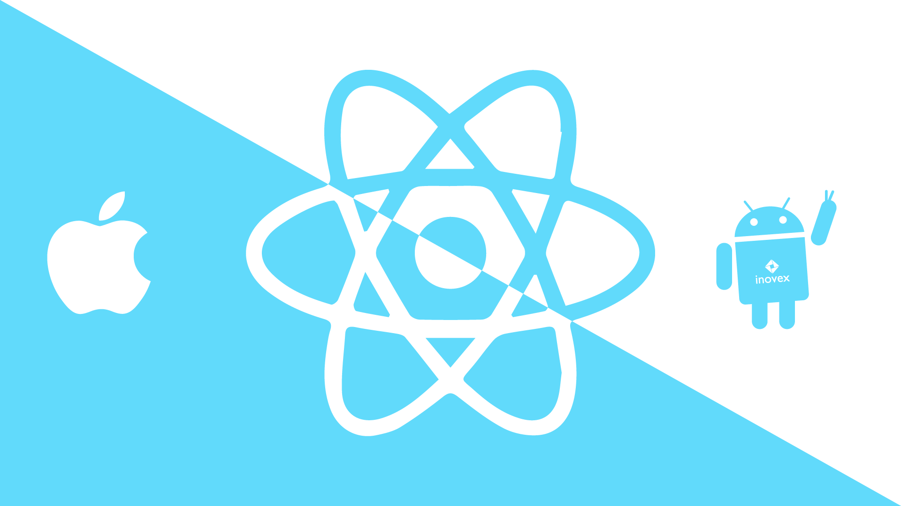

# 2º Bimestre - Atv 01

Este projeto foi desenvolvido com React + Vite + TypeScript.



## Exercícios

1. Estrutura básica do projeto
2. Uso de expressões JSX
3. Criação de componentes reutilizáveis
4. Hierarquia de componentes
5. Eventos com função inline
6. Eventos com função externa
7. Funções que retornam JSX
8. Layout com múltiplos componentes

Para executar:
```bash
cd meu-primeiro-app-react
npm install
npm run dev
